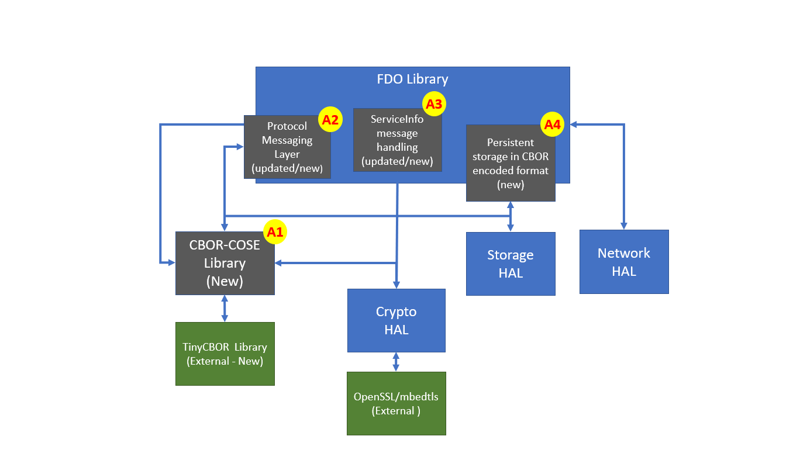
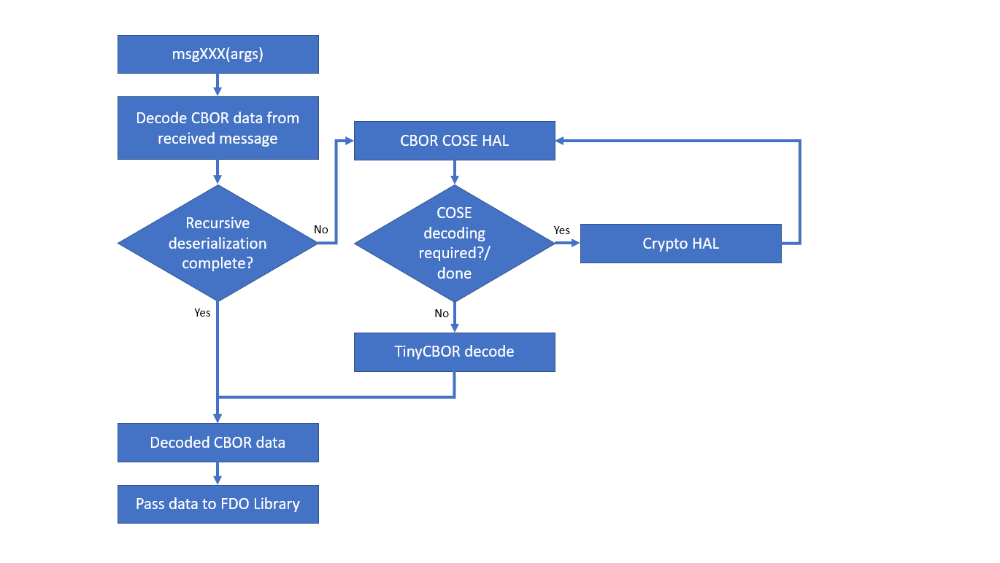

## Introduction

This document describes the changes required in the FIDO Device Onboard (FDO) Client Software Development Kit (SDK) to support the new [FIDO Device Onboard specification](https://fidoalliance.org/specs/FDO/FIDO-Device-Onboard-PS-v1.1-20220419/FIDO-Device-Onboard-PS-v1.1-20220419.html).

The FDO Client SDK is a portable C Code implementation of the FDO Device Onboarding (FDO) protocols, cryptographic operations, and associated functions required to support microcontroller (MCU) devices. The SDK is written in C since it is the language of choice for programming MCU devices. While the SDK is developed and tested on Linux, the core components of the SDK are isolated from Linux specifics via an abstraction layer. Well-known open source implementations of cryptographic libraries are used for crypto operations.

The reader is expected to be familiar with MCUs in general – their SW & HW characteristics, how they are used, typical applications, their lifecycle, etc.

## FDO Client SDK Design

The design is divided into different blocks of FDO specific implementation.  This document does not specify API-level design, but rather specifies the block-level and call-level design of the FDO design. The existing REST/JSON based protocols currently implemented in the Client SDK are replaced by the CBOR-based protocols described in the FIDO Device Onboard Proposed Standard.  Please refer to the FDO specification for complete details of the new draft protocols.

Figure 1.	Basic Block Diagram

## Changes to be Made in Client SDK

There are a few blocks and implementations to be either fully rewritten or modified to make the Client SDK compatible with the FDO specification. Those changes are described in the following sections:

### CBOR – COSE HAL Library (A1)

This block implements the following functionality:

1. CBOR Encode API – Uses the TinyCBOR library calls directly to encode data provided from upper layer to create CBOR data stream.  Data is provided back to FDO library to be sent using the network layer.
2. CBOR Decode API – Uses TinyCBOR library calls directly to decode received CBOR encoded data from servers.  Library calls may be used recursively.
3. CBOR COSE APIs – Implements the COSE API requirement using the Crypto HAL API calls as well as using TinyCBOR APIs calls. Refer to the FDO specification for further details on API requirements.

Documentation for the TinyCBOR library can be found [here](https://intel.github.io/tinycbor/current/).  

Source code for the TinyCBOR library can be found [here](https://github.com/intel/tinycbor).

### Protocol Message Layer (A2)

This layer must be adapted to the new FDO implementation. Each message API must be revisited and re-implemented as required to comply with the FDO message structure. This layer will extensively use CBOR-COSE HAL layer.

### ServiceInfo Message Handling (A3)

The FDO specification requires changes to the handling of ServiceInfo messages. Handling of ServiceInfo is done almost similar to the previous specification; however, the repeat transmit, acknowledgement, and DSI messages require full implementation in the FDO library. Unlike the current implementation, service message must be part of the FDO library rather than a separate module.

### Storage Implementation - CBOR Format (A4)

Currently, all manufacturer information and device secrets are stored in persistent storage in JSON format. The new FDO specification uses CBOR as the data encoding format, and so all data stored in persistent  storage must be done using CBOR encoding. This will reduce confusion and discourage the user from using multiple data storage formats.

All file save and load APIs must be rewritten using CBOR-COSE APIs to replace JSON encoding and decoding.

### Fido Message Handling 

The following is the detailed design for handling FDO CBOR messages in the Client SDK implementation. 

Figure 2. FDO Message Handling

1. CBOR–COSE HAL API Library will be used to decode and encode messages.
2. Crypto HAL calls will be reutilized. If additional Crypto HAL APIs are required by CDDL they can be added as part of Crypto HAL layers.

Figure 3. FDO Transmit Message Flowchart

Figure 4. FDO Receive Message Flowchart

Further Client SDK porting details can be found [here](https://github.com/fido-device-onboard/docs-fidoiot/blob/master/docs/client-sdk/client-sdk-porting-guide.md).

