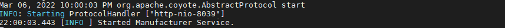
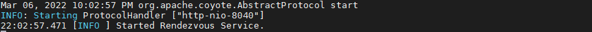
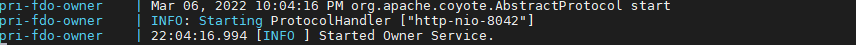

# Getting Started Guide

<style>
.wy-nav-content {
    max-width: 76% !important;
}
</style>

The FDO project provides a reference implementation of the [FIDO specification](https://fidoalliance.org/specs/FDO/FIDO-Device-Onboard-PS-v1.1-20220419/) by the FIDO Alliance.

<figure markdown="1">
   <center>
        
   </center>
</figure>

***FDO (FIDO device onboard) provides a fast and more secure way to onboard a device to any device management system. A unique feature of FDO is the ability for the device owner to select the IoT platform at a later stage in the device life cycle. The secrets or configuration data may also be created or chosen at this later stage.***

This document provides a quick walk through the E2E flow. Included in this guide:

- [Getting Started Guide](#getting-started-guide)
  - [Quick Overview of FDO](#quick-overview-of-fdo)
  - [Building FDO PRI Source](#building-fdo-pri-source)
  - [Starting FDO Server-side Containers](#starting-fdo-server-side-containers)
    - [Key Generation for FDO Server-side Containers](#key-generation-for-fdo-server-side-containers)
    - [Specifying Subject alternate names for the Web/HTTPS self-signed certificate](#specifying-subject-alternate-names-for-the-webhttps-self-signed-certificate)
    - [Enable DIGEST REST endpoints](#enable-digest-rest-endpoints)
    - [Starting the FDO PRI Manufacturer Server](#starting-the-fdo-pri-manufacturer-server)
    - [Starting the FDO PRI Rendezvous (RV) Server](#starting-the-fdo-pri-rendezvous-rv-server)
  - [Running E2E for PRI Device](#running-e2e-for-pri-device)
  - [Building Client-SDK Source](#building-client-sdk-source)
  - [Running E2E Demo for FDO Client-SDK](#running-e2e-demo-for-fdo-client-sdk)
        - [1. Start FDO Service Containers.](#1-start-fdo-service-containers)
        - [2. Start Device Initialization (DI)](#2-start-device-initialization-di)
        - [Voucher Extension for Client-SDK Device](#voucher-extension-for-client-sdk-device)
        - [TO1 and TO2](#to1-and-to2)
  - [Enabling ServiceInfo Transfer](#enabling-serviceinfo-transfer)
  - [Keystore Management](#keystore-management)
    - [Generating Self-signed keys for HTTPS/TLS Communication.](#generating-self-signed-keys-for-httpstls-communication)


## Quick Overview of FDO

FDO contains 3 major server-side components and 1 client-side component.
The server-side components include Manufacturer, RV, and Owner Service.
The client-side includes device implementation in Java (PRI) or C (Client-sdk-fidoiot).

FDO consists of four sets of protocols namely **DI, TO0, TO1, and TO2**.

1. **DI (Device Initialization protocol)**

    - Between Device & Manufacturer (**msg 10-13**).
    - Initiated by Device and Device contacts Manufacturer Service.
    - Includes creation & insertion of FDO credentials into newly manufactured device. Credential includes RVInfo which is used by device to connect with RV during T01 protocol
    - Customers can take ownership of device after DI by extending the Ownership voucher to a particular customer.
    - Ownership voucher is a credential file, passed through the supply chain, that allows an Owner to verify the Device and gives the Device a mechanism to verify the Owner.


2. **TO0 (Transfer of Ownership 0 Protocol)**

    - Between Owner & Rendezvous (RV) server (**msg 20-23**).
    - Initiated by Owner once it receives Ownership voucher and Owner contacts RV server.
    - TO0 creates a mapping between GUID and owner address and is stored in RV server's database.
    - Basically it creates a mapping like GUID=>OwnerAddress
    - OwnerAddress can be DNS/IP or combination of both.


3. **T01 (Transfer of Ownership 1 Protocol)**

    - Between Device & Rendezvous (RV) server (**msg 30-33**).
    - Initiated by Device. The Device contacts RV server using the rvInfo directives collected during DI.
    - During T01, Device identifies itself to RV server and collects the respective mapping of Owner address based on its GUID. This mapping was stored in RV during TO0.
    - The Device can use the collected OwnerAddress to contact Owner during TO2.


4. **T02 (Transfer of Ownership 2 Protocol)**

    - Between Device & Owner Server (**msg 60-71**)
    - Initiated by Device using the OwnerAddress collected during TO1.
    - Device contacts Owner Server and establishes trust and then performs Ownership Transfer.
    - During T02, Owner can transfer ServiceInfo modules to the device. These modules can include executable scripts, file payloads, and much more.


## Building FDO PRI Source

!!!Requirements
    - Check the [System Requirements](https://fido-device-onboard.github.io/docs-fidoiot/latest/installation/#system-requirements)
    - When working behind a proxy, ensure to [set proper proxy](https://fido-device-onboard.github.io/docs-fidoiot/latest/implementation-references/proxy-settings/) variables.
    - [Follow the steps](https://docs.docker.com/engine/install/ubuntu/) to setup Docker* environment.
    - [Follow the steps](https://fido-device-onboard.github.io/docs-fidoiot/latest/installation/#running-the-docker-behind-a-proxy) to setup Docker* proxy.
    - [Follow the steps](../implementation-references/proxy-settings.md) to set the right proxy settings. (Includes documentation for system wide proxy configuration)

1.&nbsp; Clone the PRI-fidoiot repository
```
git clone https://github.com/fido-device-onboard/pri-fidoiot.git
```

2.&nbsp; Build PRI-fidoiot:

!!!NOTES
    For the instructions in this document, `<fdo-pri-src>` refers to the path of the FDO PRI folder 'pri-fidoiot'.
    [Read more](https://github.com/fido-device-onboard/pri-fidoiot#building-fdo-pri-source) about PRI source building.

FDO PRI source can be **built in two ways**:

1. Using the **Maven build system** to build FDO PRI source.

```
cd <fdo-pri-src>
mvn clean install
```

2.&nbsp;Using **Docker container** to build FDO PRI source

```
cd <fdo-pri-src>/build
sudo docker-compose up --build
```

The build stage generates artifacts and stores them in `component-samples/demo` directory.

!!!NOTES

    During the build stage, the following error messages may be displayed on the console. These error messages
    are a result of the discrepancy of logging levels during the build stage and can be ignored.

            [ERROR] Picked up _JAVA_OPTIONS: -Dhttp.proxyHost= -Dhttp.proxyPort= -Dhttps.proxyHost= -Dhttps.proxyPort=
            [ERROR] WARNING: An illegal reflective access operation has occurred
            [ERROR] WARNING: Illegal reflective access by org.apache.catalina.loader.WebappClassLoaderBase to field java.io.ObjectStreamClass$Caches.localDescs
            [ERROR] WARNING: Please consider reporting this to the maintainers of org.apache.catalina.loader.WebappClassLoaderBase
            [ERROR] WARNING: Use --illegal-access=warn to enable warnings of further illegal reflective access operations
            [ERROR] WARNING: All illegal access operations will be denied in a future release


## Starting FDO Server-side Containers

<figure>
  <center>
  
  <figcaption> FIDO Device Onboard Entities and Entity Interconnection </figcaption>
  </center>
</figure>
<br>

### Key Generation for FDO Server-side Containers

1. Generating demo certificate authority KeyPair and certificate

    ```shell
      bash demo-ca.sh
    ```

    **NOTE**: Configure the properties of `demo-CA` by updating `root-ca.conf`.

2. Generating Server and Client Keypair and certificates.

    ```shell
    bash web_csr_req.sh
    bash user_csr_req.sh
    ```

    **NOTE**: Both Server and Client certificates are signed by the previously generated demo-CA. Moreover, we can configure the properties of Server and Client certificates by updating `web-server.conf` and `client.conf` respectively. [Learn how to configure Server and Client Certificates.](#specifying-subject-alternate-names-for-the-webhttps-self-signed-certificate)

3. Running keys_gen.sh will generate random passwords for the all http servers and creates `secrets` folder containing all the required `.pem` files of Client, CA and Server component.

    ```
    $ cd <fdo-pri-src>/component-samples/demo/scripts
    $ ./keys_gen.sh
    ```

    A message "Key generation completed." will be displayed on the console.

    Credentials will be stored in the `secrets` directory within `<fdo-pri-src>/component-sample/demo/scripts`.

4. Copy both `secrets/` and `service.env` file from  `<fdo-pri-src>/component-sample/demo/scripts`  folder to the individual components.

    **NOTE:** Don't replace `service.env` present in the database component with generated `service.env` in `scripts` folder.

    ```
    $ cd <fdo-pri-src>/component-samples/demo/scripts
    $ cp -r ./secrets/. ../<component>
    $ cp service.env ../<component>
    ```

    **NOTE**: Component refers to the individual FDO services like aio, manufacturer, rv , owner and reseller.

    **NOTE**: Docker secrets are only available to swarm services, not to standalone containers. To use this feature, consider adapting your container to run as a service. Stateful containers can typically run with a scale of 1 without changing the container code.

### Specifying Subject alternate names for the Web/HTTPS self-signed certificate

The subject name of the self-signed certificate is defined in the  `web-server.conf` and `client.conf`.

Uncomment `subjectAltName` and allowed list of IP and DNS in `[alt_names]` section. Example:

```
#[ req_ext ]
  subjectAltName = @alt_names

[ alt_names ]
  #Replace or add new DNS and IP entries with the ones required by the HTTPs/Web Service.
  DNS.1 = www.example.com
  DNS.2 = test.example.com
  DNS.3 = mail.example.com
  DNS.4 = www.example.net
  IP.1 = 127.0.0.1
  IP.2 = 200.200.200.200
  IP.3 = 2001:DB8::1
```

**NOTE**: Self-signed certificates created using the script is not recommended for use in production environments.

### Enable DIGEST REST endpoints


1. Update `WEB-INF/web.xml` to support Digest authentication
    ```
    <security-constraint>
        <web-resource-collection>
            <web-resource-name>apis</web-resource-name>
            <url-pattern>/api/v1/*</url-pattern>
        </web-resource-collection>
        <auth-constraint>
            <role-name>api</role-name>
        </auth-constraint>
        <user-data-constraint>
          <transport-guarantee>NONE</transport-guarantee>
        </user-data-constraint>
      </security-constraint>

      <login-config>
          <auth-method>DIGEST</auth-method>
      </login-config>
    ```
    Change `<transport-guarantee>` to `NONE` and `<auth-method>` to `DIGEST`.

2. Update `{server.api.user}` and `{server.api.password}` in `demo/<component>/tomcat-users.xml` file.


### Starting the FDO PRI Manufacturer Server

***FDO Manufacturer is an application that runs in the factory, which implements the initial communications with the Device, as part of the Device Initialize Protocol (DI). The manufacturer creates an Ownership Voucher based on the credentials received during DI and extends the voucher to the respective owner.***

Run the below commands, in a separate console, to start the Manufacturer.

```
cd <fdo-pri-src>/component-samples/demo/manufacturer/
sudo docker-compose up --build
```
Once the Manufacturer has successfully started, the following output is displayed
<figure>
  <center>
  
  <figcaption> Manufacturer getting started </figcaption>
  </center>
</figure>

### Starting the FDO PRI Rendezvous (RV) Server

***RV Server is a network server or service (For example, on the Internet) that acts as a rendezvous point between a newly powered on Device and the Owner Onboarding Service.***

Run the below commands, on a seperate console, to start the RV server.

```
cd <fdo-pri-src>/component-samples/demo/rv/
sudo docker-compose up --build
```
Once the RV instance has successfully started, the following output is displayed
<figure>
  <center>
  
  <figcaption>RV getting started </figcaption>
  </center>
</figure>

###Starting the FDO PRI Owner Server

***Owner is an entity that is able to prove ownership to the Device using an Ownership Voucher and a private key for the last entry of the Ownership Voucher. Owner supports the transfer of Serviceinfo to the Device.***

Run the below commands, on a separate console, to start the Owner Server.

```
cd <fdo-pri-src>/component-samples/demo/owner/
sudo docker-compose up --build
```
Once the Owner instance has successfully started, the following output is displayed
<figure>
 <center>
  
  <figcaption> Owner getting started </figcaption>
 </center>
</figure>

!!!NOTES
      - Proper [keystore management](#keystore-management) to be considered before using the services in production environment.
      - To0scheduling interval property can be modified in the component-sample/demo/owner/service.yml.
      Update to0-scheduler: `interval: 120`
      - [Read more](https://github.com/fido-device-onboard/pri-fidoiot/blob/master/component-samples/demo/README.MD) about starting PRI services.

## Running E2E for PRI Device

1. #####[Start FDO Service Containers](#starting-fdo-server-side-containers).

2. #####Start Device Initialization (DI)

   **When DI is initiated, device contacts manufacturer. DI includes the insertion of FDO credentials into device during the manufacturing process and creation of ownership voucher.**

   On a new console, key in the following commands

!!!NOTES
    Make sure that `di-url` is set to the correct address in `service.yml` of device. The default `di-url` value for standalone manufacturer is `http://localhost:8039`.

```
cd <fdo-pri-src>/component-samples/demo/device
java -jar device.jar
```

Expect the following line on successful DI completion.

```
DI complete, GUID is <guid>
```

**After completion of DI, the FDO credentials are stored into `app-data/credentials.bin` file. The credentials file includes `rvinfo` from manufacturer, which is later used by device to contact RV server, once it is powered on at the client side. The initialized device is then boxed and sold to customers.**

!!!Additional_Configurations
        - Additional arguments for [configuring PRI device](https://github.com/fido-device-onboard/pri-fidoiot/tree/master/component-samples/demo/device#configuring-the-device-service).
        - Configuring PRI device for [HTTPS/TLS communication](https://github.com/fido-device-onboard/pri-fidoiot/tree/master/component-samples/demo/device#configuring-device-for-httpstls-communication).
        - [Read more](https://github.com/fido-device-onboard/pri-fidoiot/blob/master/component-samples/demo/device/README.md) about Device Intialization.


#####Voucher Extension & TO0 for PRI Device

<figure>
  <center>
  
  <figcaption>Voucher extension</figcaption>
  </center>
</figure>
<br>

**During TO0, the FDO Owner identifies itself to Rendezvous Server and establishes the mapping between GUID and Owneraddress. TO0 ends with RV Server having an entry in a table that associates the Device GUID with the Owner Service’s rendezvous 'blob'. [Follow](https://github.com/fido-device-onboard/pri-fidoiot#ownership-voucher-creation) the given steps to access database table.**

Execute the following script to initiate TO0.

```
cd <fdo-pri-src>/component-samples/demo/scripts
bash extend_upload.sh -s serial_no
```

if you are using mTLS authentication mode for rest endpoints:

```
cd <fdo-pri-src>/component-samples/demo/scripts
bash extend_upload.sh -e mtls -c <path-to-generated-secrets> -s serial_no
```

or

Follow the steps to manually initiate the T00.

```
curl -D - --digest -u ${api_user}:${owner_api_passwd} --location --request GET "http://${owner_ip}:${onr_port}/api/v1/certificate?alias=${attestation_type}" -H 'Content-Type: text/plain' -o owner_cert.txt

curl -D - --digest -u ${api_user}:${mfg_api_passwd} --location --request POST "http://${mfg_ip}:${mfg_port}/api/v1/mfg/vouchers/${serial_no}" --header 'Content-Type: text/plain' --data-raw  "<content-of-owner_cert>" -o ${serial_no}_voucher.txt)

curl -D - --digest -u ${api_user}:${onr_api_passwd} --location --request POST "http://${onr_ip}:${onr_port}/api/v1/owner/vouchers/" --header 'Content-Type: text/plain' --data-raw "$extended_voucher" -o ${serial_no}_guid.txt)

curl -D - --digest -u ${api_user}:${onr_api_passwd} --location --request GET "http://${onr_ip}:${onr_port}/api/v1/to0/${device_guid}" --header 'Content-Type: text/plain')

```

***NOTE:*** To execute the above cURL calls with `mTLS` instead of `DIGEST` authentication. Replace `-D - --digest -u ${apiUser}:${api_password}` with `--cacert path-to-CA --cert path-to-client-Certificate`.

!!!Warning
    Make sure to replace `generated-password` with `api_password` property present in `component-samples/demo/<component>/service.env` file.


Here, the initial two curl calls are to **collect the Ownership voucher** from Manufacturer server and the final two curl calls are to **upload the collected voucher** to Owner. Using the received voucher, Owner initiates TO0 with RV Server using the rvAddress present in Voucher.

!!!Warning
    Make sure you are getting status `200 OK` for the curl calls. If you are facing issue with `localhost` curl calls, try with IP address instead of localhost.**

Wait for TO0 finished for <guid> message in the Owner console. This generally takes a few minutes to complete.

Expect the following message on successful TO0 completion.

```
TO0 Client finished for GUID <guid>
```

**After the completion of TO0, RV Server will have an entry in a table that associates the Device GUID with the Owner Address.**

!!!NOTE
        - [Keystore Management](#keystore-management) needs to be taken care, if PRI Rendezvous server and PRI Owner server is not running on the same machine.
        - **You can enable ServiceInfo at this stage.** [Follow the instructions](#enabling-serviceinfo-transfer) to enable ServiceInfo.

####TO1 and TO2

**During T01, Device identifies itself to the Rendezvous Server. Obtains mapping to connect to the Owner’s IP address. During T02, the Device contacts Owner and establishes trust and then performs Ownership Transfer.**

During T02,  Owner can transfer ServiceInfo modules to the device. These modules can include executable scripts, file payloads. [Read more](#enabling-serviceinfo-transfer) about serviceInfo transfers.

```
cd <fdo-pri-src>/component-samples/demo/device
java -jar device.jar
```

Wait for TO2 protocol completed message and Device is onboarded Successfully.

Expect the following message on successful TO2 completion.

```
TO2 completed successfully.
```

## Building Client-SDK Source

FDO Client-SDK source can be build by:

1. Follow instructions in the [documentation](https://github.com/fido-device-onboard/client-sdk-fidoiot/blob/master/docs/linux.md) to install dependencies.

2. Clone the repository

    ```
    git clone https://github.com/fido-device-onboard/client-sdk-fidoiot.git
    ```

!!!NOTE
    For the instructions in this document, `<client-sdk-src>` refers to the path of the FDO Client-SDK source folder 'client-sdk-fidoiot'.

3.&nbsp; Execute build.sh script

```
cd <client-sdk-src>
./build.sh
```

The build script generates artifacts and stores them in `./build/` directory.

## Running E2E Demo for FDO Client-SDK

##### 1. [Start FDO Service Containers](#starting-fdo-server-side-containers).


##### 2. Start Device Initialization (DI)

**When DI is initiated, device contacts manufacturer. DI includes the insertion of FDO credentials into device during the manufacturing process and creation of ownership voucher.**

On a new console, key in the following commands

```
cd <client-sdk-src>
./build/linux-client
```

!!!Additional_configurations
    - [Read more](https://github.com/fido-device-onboard/client-sdk-fidoiot/blob/master/docs/linux.md#7-running-the-application-) on Client-SDK Device Initialization.
    - [Configuring Client-SDK device](https://github.com/fido-device-onboard/client-sdk-fidoiot/blob/master/docs/setup.md#7-http-proxy-configuration-optional) for Proxy Network.
    - Follow instructions in the [documentation](https://github.com/fido-device-onboard/client-sdk-fidoiot/blob/master/docs/setup.md#3-setting-the-manufacturer-network-address), to update Manufacturer's address.


##### Voucher Extension for Client-SDK Device

**During TO0, the FDO Owner identifies itself to Rendezvous Server, establishes the mapping of GUID to the Owner IP address. TO0 ends with RV Server having an entry in a table that associates the Device GUID with the Owner Service’s rendezvous 'blob.'**

Execute the following script to initiate TO0.

```
cd <fdo-pri-src>/component-samples/demo/scripts
bash extend_upload.sh -s serial_no
```

if you are using mTLS authentication mode for rest endpoints:

```
cd <fdo-pri-src>/component-samples/demo/scripts
bash extend_upload.sh -e mtls -c <path-to-generated-secrets> -s serial_no
```

or

```
curl -D - --digest -u ${api_user}:${owner_api_passwd} --location --request GET "http://${owner_ip}:${onr_port}/api/v1/certificate?alias=${attestation_type}" -H 'Content-Type: text/plain' -o owner_cert.txt

curl -D - --digest -u ${api_user}:${mfg_api_passwd} --location --request POST "http://${mfg_ip}:${mfg_port}/api/v1/mfg/vouchers/abcdef" --header 'Content-Type: text/plain' --data-raw  "<content-of-owner_cert>" -o voucher.txt)

curl -D - --digest -u ${api_user}:${onr_api_passwd} --location --request POST "http://${onr_ip}:${onr_port}/api/v1/owner/vouchers/" --header 'Content-Type: text/plain' --data-raw "$extended_voucher" -o ${serial_no}_guid.txt)

curl -D - --digest -u ${api_user}:${onr_api_passwd} --location --request GET "http://${onr_ip}:${onr_port}/api/v1/to0/${device_guid}" --header 'Content-Type: text/plain')

```

***NOTE:*** To execute `mTLS` calls instead of `DIGEST`. Replace `-D - --digest -u ${apiUser}:${api_password}` with `--cacert path-to-CA --cert path-to-client-Certificate`.

!!!Warning
    Make sure to replace `generated-password` with `api_password` property present in `component-samples/demo/<component>/creds.env` file.


Here, the initial curl call is to **collect the Ownership voucher** from Manufacturer server and the final curl call is to **upload the collected voucher** to Owner. Using the received voucher, Owner initiates TO0 with RV Server using the rvAddress present in Voucher.

!!!Warning
    Make sure you are getting status `200 OK` for the curl calls. If you are facing issue with `localhost` curl calls, try with IP address instead of localhost.**

Wait for TO0 to finish for <guid> message on the Owner console.

Expect the following message on successful TO0 completion.

```
TO0 Client finished for GUID <guid>
```

!!!NOTES
    - [Keystore Management](#keystore-management) needs to be taken care, if PRI Rendezvous server and PRI Owner server is not running on the same machine.
    - **You can enable ServiceInfo at this stage.** [Follow the instructions](#enabling-serviceinfo-transfer) to enable ServiceInfo.

##### TO1 and TO2

**During T01, Device identifies itself to the Rendezvous Server. Obtains mapping to connect to the Owner’s IP address. During T02, the Device contacts Owner and establishes trust and then performs Ownership Transfer.**

During T02,  Owner can transfer ServiceInfo modules to the device. These modules can include executable scripts, file payloads. [Read more](#enabling-serviceinfo-transfer) about serviceInfo transfers.

```
cd <client-sdk-src>
./build/linux-client
```

Wait for TO2 protocol completed message

Expect the following message on successful TO completion.

```
Device onboarded successfully.
@@@@@@@@@@@@@@@@@@@@@@@@@@@@@@
@FIDO Device Onboard Complete@
@@@@@@@@@@@@@@@@@@@@@@@@@@@@@@
```

## Enabling ServiceInfo Transfer


- Create a sample linux64.sh shell script.

            #!/bin/bash
            wget https://raw.githubusercontent.com/fido-device-onboard/pri-fidoiot/master/SECURITY.md
            filename=SECURITY.md
            cksum_tx=2749598590
            cksum_rx=$(cksum $filename | cut -d ' ' -f 1)
            if [ $cksum_tx -eq $cksum_rx  ]; then
              echo "Device onboarded successfully."
              echo "Device onboarded successfully." > result.txt
            else
              echo "ServiceInfo file transmission failed."
              echo "ServiceInfo file transmission failed." > result.txt
            fi

   This script downloads the SECURITY.md file and checks the integrity of file against the pre-computed checksum value.

-  cURL command to transfer executable resource.

            $ curl --location --digest -u apiUser: --location --request POST 'http://localhost:8080/api/v1/owner/resource?filename=linux64.sh' --header 'Content-Type: text/plain' --data-binary '@path-to-executable/linux64.sh'

- cURL command to update ServiceInfo instructions. Eg:

            $ curl -D - --digest -u apiUser: --location --request POST 'http://localhost:8080/api/v1/owner/svi' --header 'Content-Type: text/plain' --data-raw '[{\"filedesc\" : \"payload.bin\",\"resource\" : \"payload.bin\"},{\"filedesc\" : \"linux64.sh\",\"resource\" : \"linux64.sh\"},{\"exec\" : [\"/bin/bash\",\"linux64.sh\"]}]'

## Keystore Management

### Generating Self-signed keys for HTTPS/TLS Communication.

1. Generate key and certificate.

        openssl req \
        -x509 \
        -newkey rsa:2048 \
        -sha256 \
        -days 3560 \
        -nodes \
        -keyout tls.key \
        -out tls.crt \
        -subj '/CN=fdo' \
        -extensions san \
        -config <( \
          echo '[req]'; \
          echo 'distinguished_name=req'; \
          echo '[san]'; \
          echo 'subjectAltName=DNS:localhost,IP:<ip-address>')


    Update `<ip-address>` with the IP address of machine running the FDO service.


2. Generate Keystore using fresh key and certificate.

    ```
    openssl pkcs12 -export -in tls.crt -inkey tls.key -out ssl.p12
    ```

    - Copy the `ssl.p12` file into `component-samples/demo/<component>/certs/` folder.
    - Update the respective `.env` file with proper keystore credentials.

3. Adding generated certificate into the truststore.

    ```
    keytool -import -alias fdo -file tls.crt -storetype PKCS12 -keystore truststore
    ```

!!!NOTES
    - [Read more](https://github.com/fido-device-onboard/pri-fidoiot/blob/master/component-samples/demo/README.MD#generating-key-pair) about key generation.
    - You can update the key type, by modifying the `-newkey` attribute during the key generation stage.
    - You can add multiple IP addresses in the `subjectAltName` attribute.
