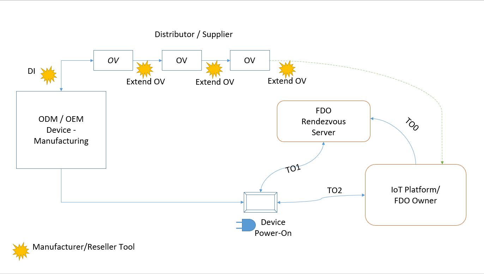
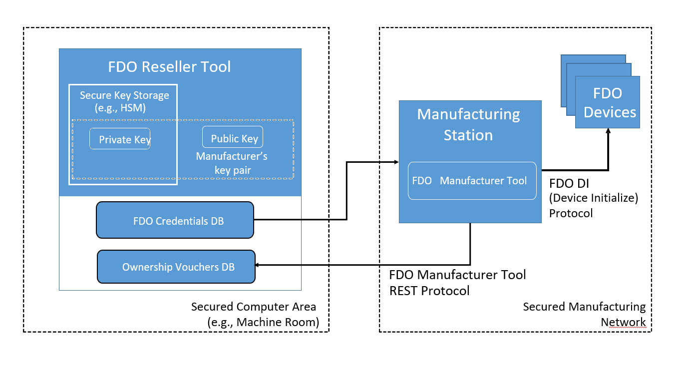

**Needs to be updated as per FDO**

## Introduction 

This document provides recommendations and best practices for all components of FIDO Device Onboard. The intended audience includes anyone enabling FIDO Device Onboard, such as device manufacturers, distributors, system integrators, IoT platform management service providers, and installers. 

Chapter 2.0 describes security requirements and best practices that should be applied throughout the entire supply chain. 

Subsequent chapters describe security requirements and best practices that impact only the functionality or role of the titled chapter. Requirements that affect more than one but not all roles are listed in the chapter for each role.  

### Document Terminology 

The document uses terminology from IETF requirements language (see RFC2119). 

- "SHALL" means that the definition is an absolute requirement of the specification.  

- "SHALL NOT" means that the definition is an absolute prohibition of the specification.  

- “SHOULD” or the adjective "RECOMMENDED" means that there may exist valid reasons in particular circumstances to ignore a particular item, but the full implications must be understood and carefully weighed before choosing a different course.  

- “SHOULD NOT” or the phrase "NOT RECOMMENDED" mean that there may exist valid reasons in particular circumstances when the particular behavior is acceptable or even useful, but the full implications should be understood and the case carefully weighed before implementing any behavior described with this label.  

- “MAY” or the adjective "OPTIONAL" means that an item is truly optional. One vendor may choose to include the item because a particular marketplace requires it or because the vendor feels that it enhances the product while another vendor may omit the same item. An implementation which does not include a particular option SHALL be prepared to interoperate with another implementation which does include the option, though perhaps with reduced functionality. In the same vein an implementation which does include a particular option SHALL be prepared to interoperate with another implementation which does not include the option (except, of course, for the feature the option provides).  

The terms MUST and MUST NOT are not used throughout this document. 

### Terminology and Assets  

FIDO Device Onboard functions to cause a FIDO Device Onboard Device to be onboarded to a FIDO Device Onboard Owner. The FIDO Device Onboard Device is typically a headless computer, such as an Internet of Things (IoT) gateway, a small computer (MCU or MCP) with sensors, sometimes called an IoT Sensor, a small computer with an actuator, or some combination of the three.  The FIDO Device Onboard Owner is a controlling computer, typically in a cloud or operations center, that controls many such devices, checking their function, turning them on or off, collecting their data, or supplying them with instructions.   

The “onboard” process is to take a device and provision into it secret information and associated information, so that the device can accept the remote control of the FIDO Device Onboard Owner’s computer. Examples of secret information are cryptographic keys, tokens, or passwords. Examples of associated information are: cryptographic certificates, IP addresses, software data or modules.   

FIDO Device Onboard allows many different kinds of provisioning to happen between FIDO Device Onboard Owners and FIDO Device Onboard Devices. We use the term “onboard” to denote a process where FIDO Device Onboard assists a customer site to provision devices for itself, rather than mandating a specific “one size fits all” provisioning process. Indeed, FIDO Device Onboard permits the customer to change provisioning mechanisms while a product is in the field, allowing security measures to be tuned continuously. 

The Ownership Voucher acts as a “ticket” to allow the FIDO Device Onboard Owner to run FIDO Device Onboard successfully. It contains digital signatures that are generated by the Device Manufacturer and Supply Chain Stakeholders. 

The FIDO Device Onboard Owner, Device, Device Manufacturer, and Supply Chain Stakeholders must protect specific assets to perform the onboarding task. It is the task of the FIDO Device Onboard Device manufacturer and the FIDO Device Onboard Owner to protect their own assets. The following table lists common assets, what they are used for, and why they should be protected. Protections are: 

- Confidentiality: this asset is a secret, and revealing it to an attacker can cause FIDO Device
  Onboard to fail. 

- Availability: this asset must be available to allow FIDO Device Onboard to function. 

- Integrity: this asset must not be modified, or FIDO Device Onboard will not function properly. 

| Asset                                                                    | Where                                             | Used For                                                                                                                                             | Protection Required (Confidentiality, Availability, Integrity)  | Why to Protect                                                                                                                                     |
|--------------------------------------------------------------------------|---------------------------------------------------|------------------------------------------------------------------------------------------------------------------------------------------------------|-----------------------------------------------------------------|----------------------------------------------------------------------------------------------------------------------------------------------------|
| GUID                                                                     | Device, Owner                                     | Identifying an FIDO Device Onboard Device before it is onboarded.                                                                                                    | A, I                                                            | The GUID allows a given Device to align with a given Owner, via the Ownership Voucher                                                              |
| Intel® EPID signing key                                       | Device                                            | Proof from Device to Owner that the Device has a particular GUID.  Often used as hardware root of trust.                                             | C, A, I                                                         | Device is rejected unless the EPID signature is correct and the EPID group is trusted                                                              |
| Intel® EPID Group ID                                          | Device, Owner                                     | A (large) number that identifies EPID keys within a specific product                                                                                 | A, I                                                            | Device proves it is a member of the group using the EPID signature; Owner must confirm that the group’s associated product is acceptable           |
| Ownership Voucher Extension (OVE) key pair, private key                  | Device Manufacturer, Supply Chain Stakeholders    | Intermediate signatures in OVE                                                                                                                       | C, A, I                                                         | Used to create a chain of signatures from manufacture to onboarding                                                                                |
| FIDO Device Onboard Owner – Signing key pair, private key                                | Owner                                             | Signing protocol operations with Rendezvous Service and Device                                                                                       | C, A, I                                                         | Used to prove Owner identity (see FIDO Device Onboard Owner private key)                                                                                           |
| Network between Manufacturing Station and device being initialized       | Manufacturer                                      | Preparing the device for FIDO Device Onboard                                                                                                                         | C, A, I                                                         | FIDO Device Onboard provisioning of initial credentials requires a trusted network environment.  Attacker can steal or modify credentials and interfere with FIDO Device Onboard.  |
| Ownership Credential (contains GUID, HMAC secret and other credentials)  | Device                                            | GUID and other credentials that allow a Device to perform FIDO Device Onboard                                                                                        | A, I (HMAC secret: C)                                           | Removing or invalidating these credentials will prevent a Device from performing FIDO Device Onboard successfully                                                  |
| Ownership Credential: HMAC Secret                                        | Device                                            | Secret value used to ensure that that Ownership Voucher is bound to the Device. Stored in the Device during manufacturing, and never revealed.       | C, A, I                                                         | Removing or invalidating these credentials will prevent a Device from performing FIDO Device Onboard successfully                                                  |
| Manufacturing Credential                                                 | Device                                            | Additional credentials that identify the manufacturer of the Device                                                                                  | A, I                                                            | Do not affect FIDO Device Onboard performance, but cause a customer confusion if modified.                                                                         |
| Ownership Voucher (contains GUID)                                        | Manufacturer à Supply Chain Stakeholders à Owner  | Identifies the FIDO Device Onboard Owner to the FIDO Device Onboard Device. Created during manufacturing, augmented by Supply Chain Stakeholders, and finally used by the FIDO Device Onboard Owner  | A, I                                                            | Acts as a “ticket” for the FIDO Device Onboard Owner to take Ownership.  FIDO Device Onboard will not function properly if it is lost or corrupted.                                |

### End-to-End Flow 

The FIDO Device Onboard end-to-end flow is illustrated in the picture below.  

Figure 1.End-to-End Flow 

| Player                                                                          | Contributions                                                                                                                                                                                     | FIDO Device Onboard-Specific Function                                                                                                                                                                                                  | Security Responsibilities                                                                                                                                                                                                                                                                                                                                                                                                                                                                                                                                                                                  |
|---------------------------------------------------------------------------------|---------------------------------------------------------------------------------------------------------------------------------------------------------------------------------------------------|------------------------------------------------------------------------------------------------------------------------------------------------------------------------------------------------------------------------|------------------------------------------------------------------------------------------------------------------------------------------------------------------------------------------------------------------------------------------------------------------------------------------------------------------------------------------------------------------------------------------------------------------------------------------------------------------------------------------------------------------------------------------------------------------------------------------------------------|
| ODM / OEM                                                                       | Manufactures Devices                                                                                                                                                                              | Enable each device with FIDO Device Onboard by executing Device Initialization (DI). DI creates the initial Ownership Voucher.                                                                                                         | Create correct FIDO Device Onboard credentials and store securely in Device. Associate Device with correct Ownership Voucher (For example, via the GUID)                                                                                                                                                                                                                                                                                                                                                                                                                                                                          |
| Supply Chain Stakeholders: ODM / OEM, Distributor, Reseller, System Integrator  | Ownership Voucher Extension                                                                                                                                                                       | Receive the Ownership Voucher from the previous supply chain stakeholder. Extend the Ownership Voucher to the next stakeholder as the device is shipped. Send the extended Ownership Voucher to the next stakeholder.  | Maintain its own Owner key pair (private key must be a secret!) Receive and verify the public key for the Owner key pair of the next Supply Chain Stakeholder1 Extend the Ownership Voucher to the correct public key Deliver the correct Ownership Voucher for the Device shipped                                                                                                                                                                                                                                                                                                                         |
| Supply Chain Stakeholders: ODM / OEM, Distributor, Reseller, System Integrator  | Ensure integrity of physical device. This is needed because automatic provisioning mechanisms (FIDO Device Onboard or other) make it easier for a rogue device that is substituted to be accepted in the network  | No FIDO Device Onboard specific function                                                                                                                                                                                               | Take measures to ensure that the correct devices are installed. Ensure that the devices have not been tampered with (open boxes, broken seals).                                                                                                                                                                                                                                                                                                                                                                                                                                                            |
| IoT Platform Service Provider                                                   | Ownership Voucher Registration                                                                                                                                                                    | Receive the Ownership Voucher from the previous supply chain stakeholder. Register the Ownership Voucher with the Intel Rendezvous Service.                                                                            | Verify that the Device Certificate (in case of ECDSA based device keys) in Ownership Voucher comes from a trusted source (system distributor or manufacturer). The Root CA or intermediate CA in the Device certificate should be trusted Register to the correct Rendezvous Service and provide the right host/IP address for IoT Platform during registration (TO0 protocol) Use the private key corresponding to the last public key in Ownership Voucher to sign the messages in TO0 protocol As a supply chain stakeholder: Maintain the FIDO Device Onboard Owner signing key pair (private key must be a secret!)   |
| System Installer                                                                | Install Device, Power On                                                                                                                                                                          | Provide Internet connectivity (natively or via helper device).                                                                                                                                                         | Identify the deployment physical location specifics to the Owner, so the Device can be operated usefully Avoid DoS attacks on the network during FIDO Device Onboard                                                                                                                                                                                                                                                                                                                                                                                                                                                       |
| IoT Platform Service Provider                                                   | Device onboarding                                                                                                                                                                                 | Runs FIDO Device Onboard TO2 protocol Aids in authentication with device by signing the messages with its Owner private key Sends the IoT application specific agents, data and credentials to the device using FIDO Device Onboard                    | Provision the device with the right set of application specific credentials for the IoT agent on the device to securely connect and communicate with the IoT platform Configure the firewall and other security properties of the device during onboarding Reconfigure the device with the new Owner key, GUID and Rendezvous Info Maintain the new Owner key for the device and keep the private key a secret                                                                                                                                                                                             |

### Cryptographic Strength 

Progress in the fields of computing and cryptography have caused cryptographic strength requirements to increase over time. A cryptographic key that was deployed securely some years ago can be broken today, based on faster and more computers and better techniques. In particular, the emerging field of quantum cryptography provides new tools that can compromise cryptographic keys. 

Cryptography deployed in FIDO Device Onboard meets or exceeds current security requirements expected for the life of this product. Customers are encouraged to track developments in quantum cryptography in order to make intelligent assessments as to their cryptographic requirements on an ongoing basis. Customers are also encouraged to watch for security notifications that indicate new emerging risks. 

## End-to-End Security Requirements 

This chapter addresses security requirements that are NOT specific to a particular component or role in the entire supply chain.  

### Key Pair’s Private Key Protection 

The private keys of all key pairs shall be protected throughout the entire supply chain, from the ODM to Cloud Service Provider. At a minimum, all private keys shall be protected at rest, for example, by storing them only on an encrypted file system, hardware security modules (HSM) or a distributed storage vault.  

Cryptographic keys require strong security at runtime, because they may be exposed to use by software.   

The FIDO Device Onboard Reseller Tool is specifically designed so that it can be deployed with sufficient security for supply chain stakeholders to protect key pair private keys.  However, the deployment must still ensure that the hardware and software are deployed safely, as below. 

#### At-Rest Protection 

At-rest protection means private keys are protected on disk or in the database but held in clear text in memory to perform signing operations. Storing the key in a file system of a machine requires careful procedural controls to ensure that the entire machine is protected from physical and virtual access.  

When backup procedures of the file system or database are in place, the same procedural controls shall be applied to the backup medium, especially when the medium is Internet accessible (for example, AWS* S3 buckets, Google Drive*). Backup of systems through cloud services (for example, Carbonite*, BackBlaze*) need additional considerations that might require case-by-case negotiations with the service provider. 

Memory isolation is therefore important to prevent leakage of keys across applications, containers, or virtual machines. 

- Private key shall never be stored in plaintext 

- Private key shall only be stored on encrypted disk or databases, or in hardware security based storages such as HSM or TPM 

- If the private key is stored in a file or database, its encryption should be anchored in a hardware-based root of trust, such as a trusted platform module (TPM) or crypto tokens, to prevent theft of keys not in use. 

- Applications performing the signing operations should only run on dedicated systems that are not being used for general compute to reduce the risk of side-channel attacks to obtain the keys. 

- The system on which the private key is stored should be physically protected from theft. 

#### Runtime Protection 

To prevent private key exposure even at runtime, it is recommended to use hardware to isolate and protect keys and key operations from other parts of the system. Crypto tokens, hardware security modules (HSMs), trusted platform modules (TPMs), or processor-assisted technologies, such as Intel® Platform Trust Technology (Intel® PTT) or Intel® Software Guard Extensions (Intel® SGX), can provide these capabilities. 

A secure element that is physically affixed to the platform ties keys and the platform together and makes key theft visually evident since the platform will be missing. 

Runtime environment (including the applications and UI) that is used to access the private key for signing operation shall be restricted to only trusted users and applications. It is highly recommended to log the usage of the key such that it can be audited later in time. 

Customers must take care, that such cryptographic hardware is only as secure as its deployment. Even a security token that can never export a private key can be exploited if it is physically stolen from the workplace. 

## ODM/OEM — Device Manufacturing  

This chapter addresses the manufacturing of devices, such as gateways or hardware appliances. 

### Manufacturing Station 

The execution of the device initialization handshake is a security sensitive operation. Due to the nature of the handshake process, trust must be provided through physical isolation such as running the manufacturing station environment on a dedicated system and connecting the device over a dedicated network.  

This is also common best practice for other manufacturing operations such as initial flashing of the BIOS. 

#### Manufacturer’s Public Key 

The Manufacturing Station requires holding the manufacturer’s public key. The hash of this key is provisioned in the device during manufacturing and represents the private key that is trusted by the device as an Owner (first owner). This key is also associated with the private key residing in the first instance of the Reseller Tool, typically deployed in the manufacturer’s data center. 

The public key shall be protected from malicious modification or replacement. 

During device initialization, an Ownership Voucher containing the first owner’s public key is created by the Manufacturing Station and sent to manufacturer’s Reseller Tool — the first Reseller Tool in the supply chain. The Manufacturing Station must be protected to prevent an adversary from performing a man-in-the-middle attack and obtaining the device’s true ownership voucher while the Manufacturing Station sends an incorrect but valid ownership voucher to Reseller Tool.

The figure above illustrates the relationship between the Reseller Tool and Manufacturing Station. 

#### FIDO Device Onboard Database 

FIDO Device Onboard database contains critical information such as the Device GUID and Rendezvous Info that is provisioned by the Manufacturer’s tool in the device during DI. In addition, it contains the Ownership Vouchers produced during manufacturing. This is not confidential information from FIDO Device Onboard security perspective but have business significance. The FIDO Device Onboard database shall be protected from access from unauthorized personnel and applications.  

#### Device Initialization Network (DI Network) 

The data that is exchanged between the device and manufacturing station during DI protocol shall be protected from modification. Otherwise the device and Ownership Voucher may have incorrect FIDO Device Onboard data, which can cause FIDO Device Onboard to fail or device to malfunction during installation. Therefore, the DI network between devices and the Manufacturing Station should be used for the sole purpose of providing the device with the software necessary to perform DI (for example, PXE boot) and the DI protocol handshake.  

### Device Manufacturing with Intel® DAL®-based Platforms 

Hardware platforms using Intel processors such as Intel Atom® or Intel® Core™ have a secure DAL® (Dynamic Application Loader) environment which are all Intel® EPID enabled and do not require special steps to provision EPID signing keys. As they are also able to run generic operating systems such as Linux*, the device is capable of running a complete application that triggers the device initialization handshake procedure between the to-be-initialized device and a manufacturing station over a network connection. 

During the DI protocol, the HMAC secret is allocated within the DAL environment of the device. The HMAC used in the Ownership Voucher is generated by the device and transmitted to the Manufacturing Station. The HMAC secret is never revealed, and automatically maintained securely in the device.  

Other credentials on such as GUID, manufacturer’s public key hash, Rendezvous Info are also protected in a secure storage and runtime environment provided by DAL®. This is all handled by the FIDO Device Onboard DAL applet provided by Intel. 

### Device Manufacturing with Non-Intel or Non-DAL® Platforms 

#### Protection (C, A, I) of Device ECDSA key 

The ECDSA key must be protected within the Device so that it can be used by the Device, but not revealed outside the Device.  Various kinds of devices have different mechanisms for performing this.  These include: 

- A secure element or TPM might store the key and perform ECDSA operations 

- The device may have a secure storage area (such as RPMB protected by secure TrustZone) that is only readable on chip.  Sometimes this requires that JTAG be disabled 

- The device may have a secure boot with an individual secure boot key, known only to the device.  Device secrets, such as the ECDSA key can be encrypted using the secure boot key or its derivation. 

- Some combination of these concepts 

Encryption alone does not protect the integrity of the ECDSA key.  A signature or HMAC mechanism is also needed.  Again, specific mechanisms vary by hardware design. 

#### Protection (C, A, I) of HMAC secret  

HMAC secret should be protected in the same way as the Device key.  

#### Protection (AI) of other FIDO Device Onboard Credentials 

Other FIDO Device Onboard credentials provisioned on the device such as Manufacturer’s Public Key Hash, GUID and Rendezvous Info do not need to be confidential.  However, to ensure their integrity, a signature or HMAC (with a protected secret) is needed.  Encryption of the credentials may be used if convenient, but encryption by itself does not ensure integrity. 

These credentials must be available to the device or FIDO Device Onboard will fail.  Some devices have internal flash regions that cannot be reprogrammed by an attacker, which can improve availability.  Secure elements may also have this property in their key protection areas. 

An OTP memory can contribute to availability and/or integrity of FIDO Device Onboard credentials.  However, since OTP memory is limited in size, this might limit the ability to use FIDO Device Onboard in its “resale” mode. 

It is acceptable for a FIDO Device Onboard Device to be limited in the number of times it can run FIDO Device Onboard.  In some cases, this might be done to improve device security, by removing the FIDO Device Onboard credentials as an attack surface. 

## Supply Chain — Ownership Voucher Extension 

Supply chain members extend Ownership Vouchers. Extension means that the next logical owner’s public key is appended to the current ownership voucher and then signed with the current owner’s private key. For a chain of keys to be valid, the private key’s associated public key was appended in the same fashion by the previous owner. Each key pair in the chain is called an Ownership Voucher Extension (OVE) key pair. 

### Ownership Voucher Extension (OVE) Environment 

The OVE environment shall be considered sensitive and part of the business-critical infrastructure. Adequate protection such as data-center access controls, firewalling, multi-tier deployment, and DMZ isolation techniques shall be applied. 

* All RESTful API access SHALL be secured using TLS 1.2 and above. 

* All RESTful API access SHOULD be secured using TLS 1.3 and above. 

* All RESTful API access SHOULD be firewalled and load-balanced. 

* Too many subsequent erroneous requests SHOULD lead to request throttling to reduce DoS attacks. 

* Database backends SHOULD be deployed on separate servers in separate zones. 
  * Database connections SHOULD be secured using TLS (have “useSSL=true&requireSSL=true" in the connection string). 

* All implementation should use the FIDO Device Onboard Reseller Tool to manage Ownership Vouchers, so that rules for Ownership Vouchers are maintained automatically: 

  * Ownership Voucher should be extended using the same key type and size as the original Owner public key in the Ownership Voucher header 

* Supply chain stakeholders shall use Ownership Vouchers only to extend for the next Owner and shall not use them to run FIDO Device Onboard TO protocols. 

### Key Lifetime Agreement 

The lifetime of the OVE key pair used for extending an Ownership Voucher SHALL be limited to a reasonable duration or number of ownership extensions.  

From a supply chain perspective, sending the OVE’s public key to the supplier (along with the order) and receiving one extended Ownership Voucher per ordered device is tightly coupled to the purchase order. The supplier knows how many Ownership Vouchers will be extended for a particular purchase order. 

The private key shall be kept until the device is purchased by the next owner or the device is retired. The key is needed to extend the Ownership Voucher to the next Owner. 

## Service Provider — Owner Implementation 

The FIDO Device Onboard Owner Implementation is responsible for receiving the final Ownership Voucher in the supply chain and issuing the TO0 protocol to the Rendezvous Server. The owner implementation is typically tightly integrated into the IoT Platform Management service provider’s environment, therefore developed, built, and managed by the provider. It is also the point where the device is logically associated with a particular Management service account. 

The owner implementation runs in a secured facility such as a data center. 

### Owner Key Pair Usage 

The Management service administrator provides the public key to the previous entity in the supply chain. The associated private key is used during the TO0 protocol phase with the Rendezvous Server. 

Each service account should have individual key pairs. This allows the Management Service to differentiate incoming ownership vouchers by account and to refuse vouchers extended to the wrong account. 

Private keys shall be protected as mentioned in Section 2.1. If the private key is exposed, (a) adversary devices can be added to an account without authorization, (b) legitimate devices can be added to adversary accounts. 

Key pair retirement: Private keys have to be available for signing operations until all the associated Ownership Vouchers have been consumed using the TO2 protocol.  The Owner may cycle keys so that new Ownership Vouchers use the newer keys, but the old keys are still needed for signing (in the TO0 and TO2 protocols) until all Ownership Vouchers that reference them are processed. 

### Runtime Protection of Owner Signing Keys 

The recommendation is to protect owner signing keys using security hardware. However, in large-scale operations with a significant number of accounts, the number of available hardware-protected keys might be limited. In this case, a two-step process should be deployed.  

The private key corresponding to the public key exposed to the account owner for ownership extension is protected only at rest. The ownership vouchers extended to that public key are then extended to a second public key where the corresponding private key is located in an HSM. 

The HSM is used to perform the signing operation for the final TO0 process. 

Since steps 1 and 2 are performed in temporal proximity, it is exactly known how long the private key is needed since Ownership Vouchers are never extended to the associated public key without performing TO0.  

The two-step process allows simplified key management and rolling the HSM key pair at a regular basis. 

## Installer Notes  

FIDO Device Onboard simplifies the onboarding process by eliminating cumbersome manual provisioning. Such form of automation, however, also creates risks of attacks based on social engineering that should be mitigated by proper installation and verification practices. 

### Verification of Authenticity of Devices 

Installers shall verify the origin of the devices to be installed. If a device’s origin is not known and the device was exchanged, or tampered with between manufacturing and installation, an adversary can onboard a malicious FIDO Device Onboard-enabled device in a target environment without much inside knowledge of the environment. After power-up, the FIDO Device Onboard-enabled device would connect to the adversary’s device management service and be under its control. 

### Installation Complete Test 

The danger of introducing a rogue device into the customer’s network is higher when automatic provisioning (including FIDO Device Onboard) is used than when each device is manually configured. Under manual configuration, an attacker needs to compromise a device and a person to install it. Under automatic provisioning, the attacker needs only to compromise the device and fool a trusted person to install it. For example, the attacker can switch boxes.   

After the onboarding process has completed, the installer should verify that the device is under the control of the expected device management service. For example, by evaluating that the device’s serial number shows up in the management console.  Keeping a count of systems physically installed and systems newly seen at the management console is also useful. 

If the device does not report an onboarding error but cannot be verified in the Management service console, the device should not be left connected. 

### Network Restrictions at Installation 

The following additional measures are useful to prevent a rogue device from successfully operating in a customer environment, and should be implemented whenever feasible: 

* Network authentication for IoT devices. FIDO Device Onboard itself may be used to configure the network authentication into trusted (“non-rogue”) devices. When all devices must be authenticated to the local network in order to function, a rogue device may be unable to connect to its intended (rogue) manager and thus fail to exfiltrate data. 

* Network security for IoT devices that prevents them from arbitrary connection to the Internet. In many cases, IoT devices need only connect to a few sites on the Internet (for example, for software update, device management, data upload). If network access can be restricted to these sites, a rogue device may be restricted from exfiltrating data. 

These measures overlap in their effectiveness. In some cases, one may be easier to implement than the other. For security measures, the best policy is to implement both; a belt and suspenders back each other up from embarrassing failures. 

## IoT Security Practices, Implementation Notes 

FIDO Device Onboard does not guarantee the security of an IoT device; it just gives a good start.  For most of the lifetime of the device, it must secure itself. Indeed, a failure in device security may also allow FIDO Device Onboard security to fail. The following best practices are needed to ensure that an IoT device securely implements FIDO Device Onboard. In general, these are good security practices that are always recommended. 

* Secure or Verified boot. Ensure that only the desired operating system will load, so expected OS protections are implemented as predicted. 

* Secure the OS and the file system, using one of the many best practices guides available. 

* Secure the FIDO Device Onboard programs and data stored on the OS. 

* Deploy the FIDO Device Onboard Owner in a protected data-center type environment, where physical and login access is strictly controlled. 

* Protect the keys for the FIDO Device Onboard Owner using hardware security (HSM, TPM, and others). 

* Use secure protocols to communicate with IoT devices, and using two-way authentication (from manager to IoT device and IoT device to manager). 

* Use standard protocols (For example, TLS 1.3) and standard implementations, to benefit from the additional security reviews done on them 

* Use the latest versions of these implementations and update them as new ones appear 

* Secure programming practices must be used when implementing FIDO Device Onboard components 

* Care must be taken when implementing FIDO Device Onboard only to implement the FIDO Device Onboard protocols that are needed for this implementation. For example, do not enable the FIDO Device Onboard Device protocols for an FIDO Device Onboard Owner implementation. Never enable the FIDO Device Onboard Device Initialize implementation other than on a Device in manufacturing. 

* EPID revocation information must be updated in a timely manner by FIDO Device Onboard Owners.  When the Intel® EPID verification service is used (this is the default), this happens automatically. 

* FIDO Device Onboard Devices with a single Trusted Computing Base (no Trusted Execution Environment) must have all the EPID keys in EPID groups only associated with the same product (for example, all keys in EPID groups for a given toaster product, or a given industrial actuator, but no groups with products mixed inside of them). This security practice is useful because FIDO Device Onboard EPID authentication is by group membership. If groups contain mixed products, an attacker who penetrates a less valued target (for example, the toaster) may leverage this effort toward a more valued target (for example, a factory with industrial controllers in it). 

  * The exception is when FIDO Device Onboard is implemented in a trusted execution environment with hardware protection of its own, that is, a separate Trusted Compute Base.  In this case, the EPID group may follow the Trusted Compute Base (TCB) for the FIDO Device Onboard implementation, and the main execution environment (outside the Trusted Execution Environment) may span many products.   
